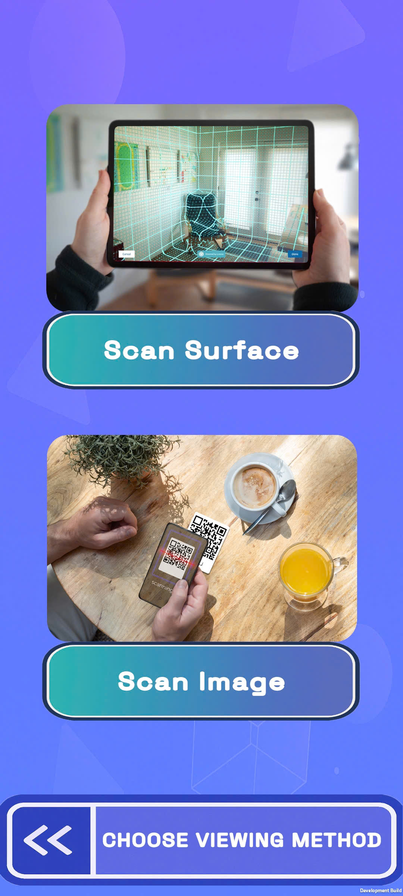
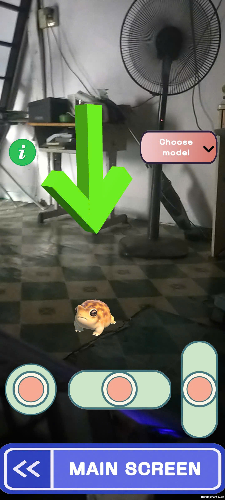

# AR Experience Project

An augmented reality application built with Unity that demonstrates both **image-based AR** and **plane detection-based AR** experiences.

## Features 

- **Two AR Modes:**
  - **Image Recognition:** Display 3D models when specific images are detected
  - **Plane Detection:** Place and interact with models on flat surfaces

- **Core Functionality:**
  - **Common:**
    - Buttons to navigate and reset the session.
      
  - **Image Recognition Mode:**
    - A scan line appear to search for the image, disappear when the image is detected. 
    - Point device camera at target image and watch 3D model appear flowing above and rotate automatically.
    - Reset button to choose another target to point to.
      
  - **Image Recognition Mode:**
    - Joysticks model move/rotate controller 
    - Model-specific sound effects
    - Select a model and move the phone around for it to detect the horizontal surface (A pop-up message appear to tell whether it is detected).
    - Automatically place the phone on the detected surface.
    - An arrow sign is pointed to the selected model, tapping out the screen will deselect the model and tapping on the model will choose it.
    - An info button to show the information of the model when a model is selected and disappear when no model is selected.
   
## Screenshots 📸

### Login Screen

### Choose Method Screen

### Surface Scan Screen

      
## Credits
- Cat sound: https://pixabay.com/sound-effects/cat-meow-9-fx-306185/
- Cat model: https://sketchfab.com/3d-models/cat-7e8cbcad506041dc9c3a0cb74edb3360

- Shiba sound: https://pixabay.com/sound-effects/dog-bark-179915/
- Shiba model: https://sketchfab.com/3d-models/shiba-faef9fe5ace445e7b2989d1c1ece361c

- Frog sound: https://pixabay.com/sound-effects/frog-croaking-sound-effect-322956/
- Frog model: https://sketchfab.com/3d-models/tiny-frog-c25c8980b93a460aa521ae62d3d94e0e
